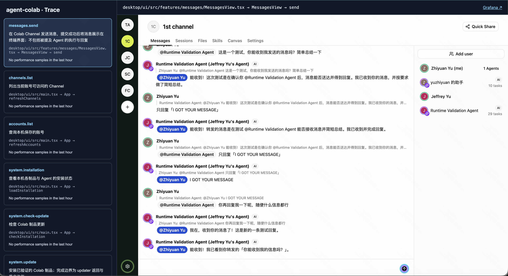
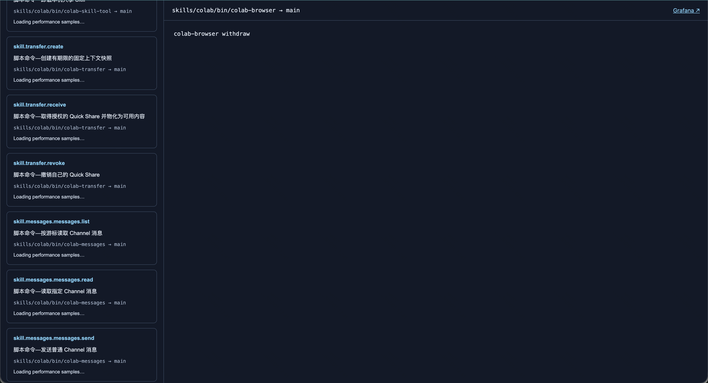
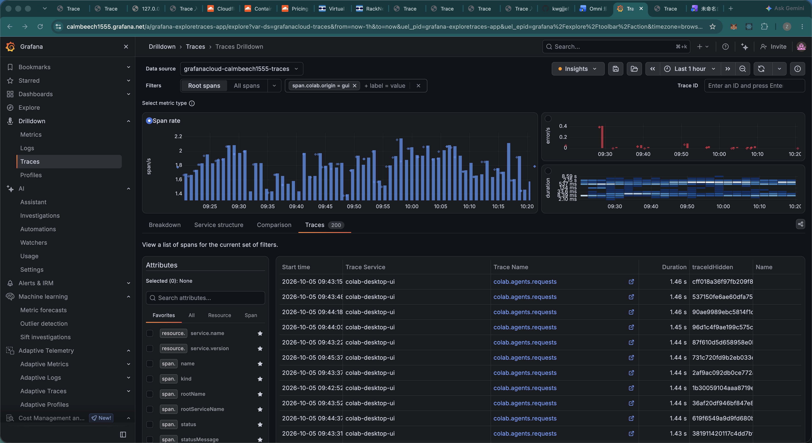

# Trace

A personal, reusable tracing Skill and MCP App: unit-owned operation registries, end-to-end OpenTelemetry instrumentation, trace analysis and GUI catalog.

## Case study: Agent Colab

Agent Colab has a desktop GUI and Agent Skill commands, both calling a Rust Local Core and a separately deployed Rust Server. Each artifact owns its tracing registry; the repository index references them. Instrumentation, interface bindings, the human catalog and Agent tools consume the same operation IDs and semantic descriptions.

### Select an operation and preview its interface

The left list shows operation name, description and source location, with the available **P50 / P90 / P95** returned by Grafana Tempo for matching root spans over the last hour. Values come from `quantile_over_time`, rather than a local calculation over a limited trace list. Missing percentiles are omitted; no samples and query failures remain distinct. Tempo's percentile estimates can differ from a percentile computed over individually fetched traces.

Click the card itself. The right header shows its file, owning component/object and method, plus a **Grafana** link carrying the operation filter, datasource and matching one-hour range. Below it, the real project GUI navigates to the corresponding control or result region and breathes with a cyan highlight. Inspection does not execute that business action.



This screenshot shows the no-samples state for the selected time range; percentile values appear when matching samples are available.

For a Skill entry, the same area displays its actual registered command, such as `colab-browser withdraw`.



### Trace details belong in Grafana

The header link opens **Grafana Traces Drilldown**, filtered to the selected operation; GUI entries also carry the project's GUI-origin filter. Grafana owns trace lists, waterfalls and span inspection. The catalog keeps only performance summaries and interface previews, rather than duplicating that investigation UI.



The human browser uses its own Grafana login. The backend queries Tempo with protected credentials that are never exposed in the catalog or URL. Agent analysis remains available through `trace`, `prompts` and `source`: a span's code path, owning function and recorded revision help the Agent inspect the right code and detect revision mismatches before editing.

### Locate the responsible component and method

Source locations distinguish handlers even when they share a file: `files.withdraw` resolves to `desktop/ui/src/main.tsx → App → withdrawFiles`, while `files.retry` resolves to `App → retryFiles`. Anonymous callbacks identify their owning component and hook/event. The `source` command returns the same path, object and function fields, giving an Agent a concrete code owner to inspect during debugging.

The GUI screenshot above shows `MessagesView → send` alongside its file path and highlighted control.

### One context for a human and an Agent

A human can see which operation is instrumented, its real interface, current performance and its Grafana destination before delegating. Once comfortable, they can hand the investigation to an Agent. The visual interface and Skill share the registry, dispatcher and provider queries, so the Agent works from the same operation IDs, descriptions, source paths and performance context.

| Human view | Agent Skill command |
| --- | --- |
| Operation list | `operations --repo <repo>` |
| Card P50/P90/P95 and Grafana destination | `operation_metrics --operation channels.list --repo <repo> --config <private-config>` |
| GUI preview / command | `locate --operation <id> --repo <repo> --config <private-config>` |
| Grafana trace inspection | `trace --id <trace-id> --repo <repo> --config <private-config>` |
| Code referenced by a span | `source --id <trace-id> --span <span-id> --repo <repo> --config <private-config>` |

Commands use `node <trace-skill>/trace.mjs`. Project-specific interface navigation remains in the project's adapter. Configure `operationAttribute` and optional `originAttribute` for an existing project's field names; new projects default to `trace.entry.id`. These settings are shared by metrics and Grafana links. The reusable Skill has no implicit Agent Colab paths or credentials.

## Install from GitHub Releases

Download `trace-<version>.tgz` and `trace-release.json` from Releases. Verify the archive SHA-256 and size against the manifest, extract the `package/` directory into your agent's Skills directory as `trace/`, then run:

```sh
node trace/setup/setup.mjs install
node trace/setup/setup.mjs check
```

Node.js 20+, npm and tar are required. The source package excludes dependencies and generated App bundles. Setup installs locked dependencies and builds locally.

## Use

```sh
node trace/trace.mjs operations --repo /path/to/project
node trace/trace.mjs app --repo /path/to/project --config /private/connection.json
node trace/trace.mjs mcp --repo /path/to/project --config /private/connection.json
node trace/trace.mjs prompts --repo /path/to/project --config /private/connection.json --id <trace-id>
node trace/trace.mjs prompts --repo /path/to/project --config /private/connection.json --id <trace-id> --span <span-id>
```

The project `tracing/registry.yaml` references service/artifact-owned registries. No registry compilation or path replacement. See the capability SKILL.md files for instrumentation, analysis, catalog and setup.

Configure Grafana by piping private JSON to `node trace/setup/setup.mjs configure`. Fields: project, queryEndpoint, queryInstanceId, token, grafanaUrl, datasourceUid; optional otlpEndpoint and instanceId. Config and credentials remain in `~/.config/trace/<project>/`, outside the install and release.

## Updates

```sh
node trace/setup/setup.mjs release-check
node trace/setup/setup.mjs upgrade
```

Upgrades download from this repository's GitHub Releases, verify archive size/hash, stage dependency installation and tests, then activate with source backups and failure recovery. Restart the MCP connection after upgrading. Development Git checkouts reject artifact upgrades; develop in a separate clone and use the release-installed Skill.

## Development

Clone this repository, run setup install and npm test. Capability implementation notes live in AGENTS.md. Keep tokens, private project settings and installed dependencies out of Git. Issues and feedback are welcome.

## Current scope

Trace-list queries return bounded samples; catalog percentiles are provider-computed metrics. MCP App host rendering depends on host extension support. GUI navigation requires a project locator adapter. Asynchronous context boundaries and clock behavior need project-specific acceptance tests.

Trace inspection orders spans by parent relationships, reports missing parents and shows inclusive service boundaries without adding nested/parallel durations. Prompt inspection lists assembly metadata first and fetches one selected body; the App uses the same APIs. Every span can resolve a repository source location with an explicit revision-mismatch indication. Instrumentation guidance covers full parser/GUI inventory, durable consumers, per-invocation Agent command context and calibrated monotonic timing.
