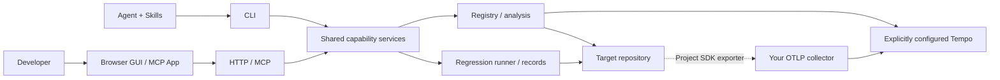

# Agent DevOps Suite

A local toolkit for coding agents and developers to instrument operations, investigate traces, run regression tests and inspect evidence together. Agent Skills, a deterministic CLI, an MCP App and a browser GUI share the same capability services.

> Alpha: suitable for evaluation. MCP embedded rendering depends on the host; installation and runtime support are tested on the platforms listed below. Future capabilities are not shipped features.

## What works

- Unit-owned operation registries and end-to-end OpenTelemetry instrumentation guidance
- Grafana Tempo trace queries, provider-computed percentiles and source resolution
- Project-owned regression cases, execution plans, cancellation and persistent Run/Round evidence
- Latest completed result per case across repair rounds, available to agents and the GUI
- A shared browser workspace and MCP App for operation catalogs and regression records
- Verified GitHub Release installation and staged upgrades with source backups

The product name is **Agent DevOps Suite**. The GitHub repository, `trace.mjs`, `trace_*` MCP tools, installation path and release asset names remain compatible with existing Trace installations. `agent-devops.mjs` is the suite entry point in source. This is one release unit today; capabilities are modules, not independently versioned products.

[Product website](https://agent-devops.zhiyuanwangluo.online) · [Configuration](docs/configuration.md) · [Architecture](docs/architecture/README.md)

## Install

Give your agent this instruction:

> Install Agent DevOps Suite from the command below. Download the latest GitHub release, verify it, detect and install missing runtime dependencies, then check that the Skill is ready. Preserve any existing project configuration and credentials. Restart the agent connection if needed.

```sh
curl -fsSL https://raw.githubusercontent.com/kwgjjeffrey/trace/main/setup/install.sh | sh
```

The installer supports macOS, Linux and WSL. It reuses Node.js 20+ when available; otherwise it downloads and verifies an official Node.js 22 runtime into a private user directory, without sudo or changing global Node. It verifies the release archive size and SHA-256, installs locked dependencies, builds the App and checks readiness. The default destination is `${CODEX_HOME:-~/.codex}/skills/trace`; set `TRACE_INSTALL_DIR` to choose another agent's Skills directory. Existing installations use the staged update and backup flow; provider credentials stay outside the Skill.

If Node is not on your PATH, invoke commands through `sh <trace-skill>/setup/run.sh trace.mjs <command>` or `sh <trace-skill>/setup/run.sh setup/setup.mjs <command>`. The launcher finds the private runtime automatically.

Connect a target repository after installation:

```sh
sh ~/.codex/skills/trace/setup/run.sh trace.mjs project-setup --repo /path/to/repo --regression true
```

This idempotently adds a marked Trace dependency/install block to root `AGENTS.md` and initializes project-owned regression files with a commented case-only example. Existing configuration and cases are preserved. Omit `--regression true` for instrumentation/analysis dependency guidance only. No business code or project dependencies are changed.

## Add GUI location to your project

```sh
node <trace-skill>/trace.mjs locator-install --repo /path/to/project --directory frontend/diagnostics/page-locator
```

This installs a framework-independent source module with TypeScript declarations and a version/hash receipt. Import `mountLocator`, explicitly enable it in the developer diagnostic page, supply the live operation registry and allowed catalog origins, and bind controls with `data-trace-target`. Set `project.previewUrl` in the repository index. The Skill's [page locator instructions](instrumentation/locator/SKILL.md) cover navigation, iframe policy and acceptance.

The module owns message validation, safe navigation, scrolling and breathing highlights. Your project owns authentication, page URLs, diagnostic activation and route-specific registration. It does not execute highlighted business actions or copy the registry. The same install command upgrades unchanged module files and rejects local modifications.

Agent Colab now uses this installed module; its former custom highlighter has been removed. The remaining adapter only proxies its authenticated GUI and supplies the live registry and diagnostic bootstrap.

## Case study: Agent Colab

Agent Colab has a desktop GUI and Agent Skill commands, both calling a Rust Local Core and a separately deployed Rust Server. Each artifact owns its tracing registry; the repository index references them. Instrumentation, interface bindings, the human catalog and Agent tools consume the same operation IDs and semantic descriptions.

### Select an operation and preview its interface

The left list shows operation name, description and source location, with the available **P50 / P90 / P95** returned by Grafana Tempo for matching root spans over the last hour. Values come from `quantile_over_time`, rather than a local calculation over a limited trace list. Missing percentiles are omitted; no samples and query failures remain distinct. Tempo's percentile estimates can differ from a percentile computed over individually fetched traces.

Click the card itself. The right header shows its file, owning component/object and method, plus a **Grafana** link carrying the operation filter, datasource and matching one-hour range. Below it, the real project GUI navigates to the corresponding control or result region and breathes with a cyan highlight. Inspection does not execute that business action.


This screenshot shows the no-samples state for the selected time range; percentile values appear when matching samples are available.

For a Skill entry, the same area displays its actual registered command, such as `colab-browser withdraw`.


### Trace details belong in Grafana

The header link opens **Grafana Traces Drilldown**, filtered to the selected operation; GUI entries also carry the project's GUI-origin filter. Grafana owns trace lists, waterfalls and span inspection. The catalog keeps only performance summaries and interface previews, rather than duplicating that investigation UI.


The human browser uses its own Grafana login. The backend queries Tempo with protected credentials that are never exposed in the catalog or URL. Agent analysis remains available through `trace`, `prompts` and `source`: a span's code path, owning function and recorded revision help the Agent inspect the right code and detect revision mismatches before editing.

### Locate the responsible component and method

Source locations distinguish handlers even when they share a file: `files.withdraw` resolves to `desktop/ui/src/main.tsx → App → withdrawFiles`, while `files.retry` resolves to `App → retryFiles`. Anonymous callbacks identify their owning component and hook/event. The `source` command returns the same path, object and function fields, giving an Agent a concrete code owner to inspect during debugging.

The GUI screenshot above shows `MessagesView → send` alongside its file path and highlighted control.

### One context for a human and an Agent

A human can see which operation is instrumented, its real interface, current performance and its Grafana destination before delegating. Once comfortable, they can hand the investigation to an Agent. The visual interface and Skill share the registry, dispatcher and provider queries, so the Agent works from the same operation IDs, descriptions, source paths and performance context.

| Human view | Agent Skill command |
| --- | --- |
| Operation list | `operations --repo <repo>` |
| Card P50/P90/P95 and Grafana destination | `operation_metrics --operation channels.list --repo <repo> --config <private-config>` |
| GUI preview / command | `locate --operation <id> --repo <repo> --config <private-config>` |
| Grafana trace inspection | `trace --id <trace-id> --repo <repo> --config <private-config>` |
| Code referenced by a span | `source --id <trace-id> --span <span-id> --repo <repo> --config <private-config>` |

Commands use `node <trace-skill>/trace.mjs`. Project-specific interface navigation remains in the project's adapter. Configure `operationAttribute` and optional `originAttribute` for an existing project's field names; new projects default to `trace.entry.id`. These settings are shared by metrics and Grafana links. The reusable Skill has no implicit Agent Colab paths or credentials.

## Use

```sh
node trace/trace.mjs operations --repo /path/to/project
node trace/trace.mjs app --repo /path/to/project --config /private/connection.json
node trace/trace.mjs mcp --repo /path/to/project --config /private/connection.json
node trace/trace.mjs prompts --repo /path/to/project --config /private/connection.json --id <trace-id>
node trace/trace.mjs prompts --repo /path/to/project --config /private/connection.json --id <trace-id> --span <span-id>
```

The project `tracing/registry.yaml` references service/artifact-owned registries. No registry compilation or path replacement. See the capability SKILL.md files for instrumentation, analysis, catalog and setup.

Configure Grafana by piping private JSON to `node trace/setup/setup.mjs configure`. Fields: project, queryEndpoint, queryInstanceId, token, grafanaUrl, datasourceUid; optional otlpEndpoint and instanceId. Config and credentials remain in `~/.config/trace/<project>/`, outside the install and release.

## Updates

```sh
node trace/setup/setup.mjs release-check
node trace/setup/setup.mjs upgrade
```

Upgrades download from this repository's GitHub Releases, verify archive size/hash, stage dependency installation and tests, then activate with source backups and failure recovery. Restart the MCP connection after upgrading. Development Git checkouts reject artifact upgrades; develop in a separate clone and use the release-installed Skill.

## Architecture

### Runtime and deployment boundaries

Skills guide an agent to deterministic commands. The CLI, browser HTTP server and MCP transport call shared capability services; the React GUI renders their results and does not own query or runner logic. The local runtime is Node.js. There is no bundled hosted application server, and installing the suite does not deploy Tempo or Grafana.



The suite queries your configured provider. **Your application's OpenTelemetry SDK exports spans directly to your collector**; the suite does not route them through a maintainer service. Grafana owns trace waterfalls and detailed span inspection. The catalog owns semantic operation selection, summary metrics and explicit project interface location.

### Repository-owned definitions and persistent evidence

The target repository owns its registry index, unit registries, instrumentation adapters, GUI locator bindings, regression cases and environment contracts. Indexes reference live definitions; no compiled registry copy becomes a second source of truth. Discovery parses case metadata without importing business scripts.

Run and Round records belong to the target repository's configured record root. Records store outcomes, evidence and script digests, not archived case source. Latest results use the most recent terminal outcome for each case; pending/running/excluded rows do not overwrite completed evidence. A finished scheduler is not evidence that tests passed.

### Configuration and trust boundaries

Installation state and dependencies belong to the suite directory. Provider connection files and credentials live separately in protected per-project files under `~/.config/trace/<project>/`. Queries require an explicit config path (`--config` or `TRACE_CONFIG`); there is no maintainer tenant, token or OTLP destination fallback. Regression discovery and execution do not require a tracing provider.

See [provider configuration](docs/configuration.md) for separate query/export settings, and [architecture](docs/architecture/README.md) for module ownership, call direction and extension rules.

### Repository and release units

| Directory | Responsibility |
| --- | --- |
| `SKILL.md` and capability Skills | On-demand agent workflow instructions |
| `trace.mjs`, `agent-devops.mjs`, `lib/` | CLI routing and shared contracts |
| `instrumentation/` | Live registry validation, adapters and GUI locator module |
| `analysis/` | Provider queries, trace interpretation and source evidence |
| `regression_test/` | Case discovery, planning, runner lifecycle and record persistence |
| `catalog/` | MCP/HTTP transports and shared React GUI |
| `setup/`, `release/` | Installation, protected configuration, updates and source artifacts |
| `website/` | Standalone product website; excluded from installed runtime |

### Release model

GitHub Releases is the current distribution channel. `distribution.json` declares its repository and manifest. A versioned source archive and `trace-release.json` bind version to source commit, byte size and SHA-256. The installer verifies the tag and archive before dependency installation; updates validate a staged source tree before activation and retain source backups. Hash verification is integrity verification against the GitHub channel, not an independent publisher signature. Activation is not whole-directory atomic; interrupted updates may require recovery.

## Development

Clone this repository, run setup install and npm test. Capability implementation notes live in AGENTS.md. Keep tokens, private project settings and installed dependencies out of Git. Issues and feedback are welcome.

## Contributing and security

Read [CONTRIBUTING.md](CONTRIBUTING.md) before changing module boundaries. Report credential exposure or unsafe archive/source handling through [SECURITY.md](SECURITY.md). The suite is [MIT licensed](LICENSE).

## Current scope

Trace-list queries return bounded samples; catalog percentiles are provider-computed metrics. MCP App host rendering depends on host extension support. GUI navigation requires a project locator adapter. Asynchronous context boundaries and clock behavior need project-specific acceptance tests.

Trace inspection orders spans by parent relationships, reports missing parents and shows inclusive service boundaries without adding nested/parallel durations. Prompt inspection lists assembly metadata first and fetches one selected body; the App uses the same APIs. Every span can resolve a repository source location with an explicit revision-mismatch indication. Instrumentation guidance covers full parser/GUI inventory, durable consumers, per-invocation Agent command context and calibrated monotonic timing.
